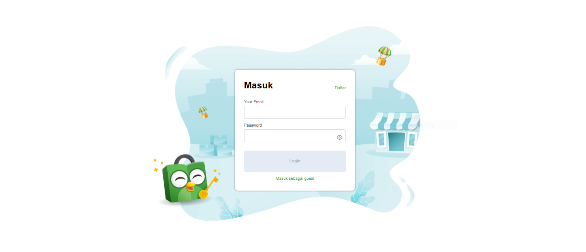
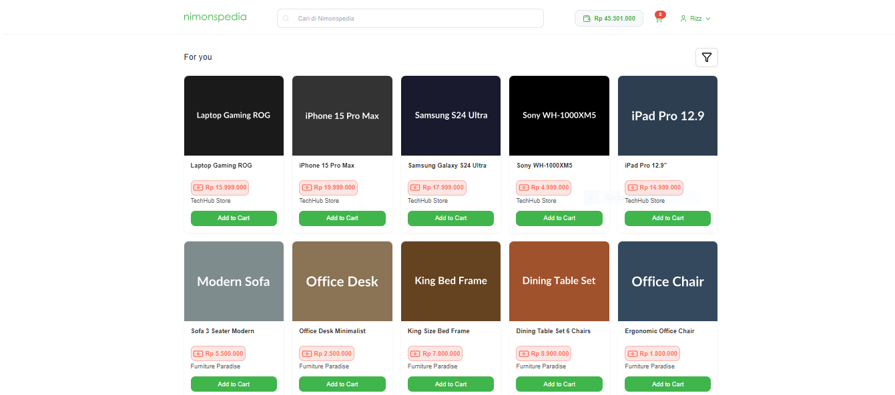
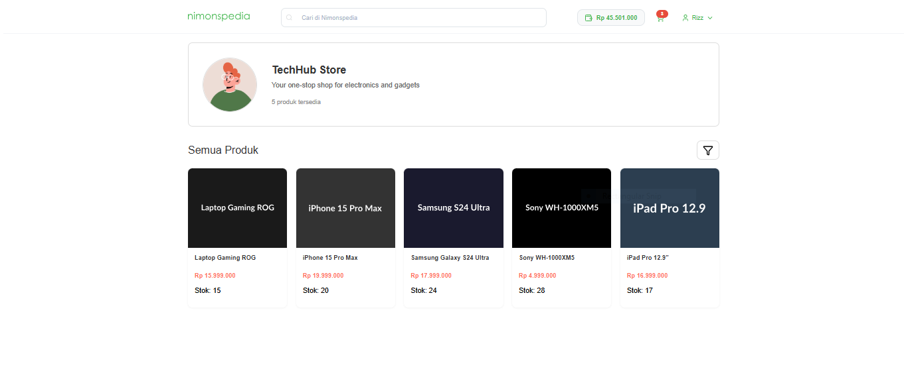
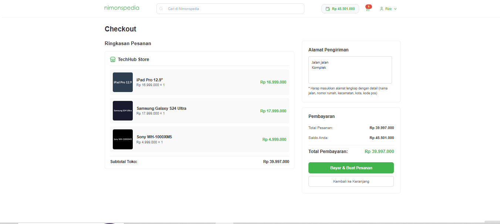
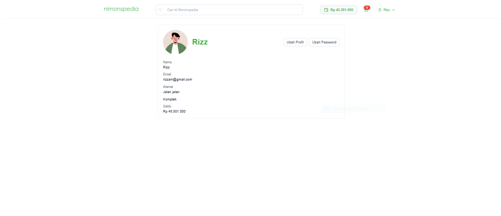
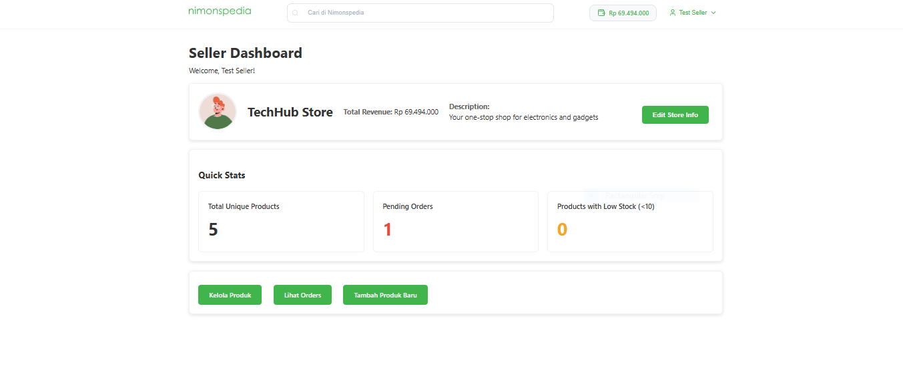

# Nimonspedia
Nimonspedia adalah sebuah platform e-commerce sederhana yang dirancang untuk memenuhi kebutuhan jual beli online. Aplikasi ini menyediakan dua peran utama: Pembeli (Buyer) dan Penjual (Seller), dengan fitur-fitur yang disesuaikan untuk masing-masing peran.

Pembeli dapat menjelajahi produk, melihat detail toko, menambahkan produk ke keranjang, dan melakukan proses checkout. Penjual dapat mengelola informasi toko, menambah dan mengelola produk, serta memproses pesanan yang masuk.

## Daftar Requirement
Untuk menjalankan aplikasi ini di environment lokal, Anda memerlukan:

-   **PHP 8.2** atau lebih tinggi
-   **PostgreSQL** sebagai database
-   **Docker** dan **Docker Compose** (Metode yang direkomendasikan)
-   Web Browser modern (Chrome, Firefox, Edge, dll.)

Install PHP: install [here](https://www.php.net/downloads.php)
Install Docker by desktop or WSL: access [here](https://docs.docker.com/get-started/get-docker/) for more information

## Cara Instalasi

1.  **Clone Repository**
    ```bash
    git clone https://github.com/Labpro-22/milestone-1-tugas-besar-if-3110-web-based-development-k03-07.git
    cd milestone-1-tugas-besar-if-3110-web-based-development-k03-07
    ```

2.  **Konfigurasi Environment**
    Copy file `.env.example` yang ada di dalam direktori `src` menjadi file baru bernama `.env`.
    ```bash
    cd src
    cp .env.example .env
    ```
    Buka file `.env` dan sesuaikan kredensial database (username, password, nama database) sesuai dengan kebutuhan Anda.

## Cara Menjalankan Server

Aplikasi ini dirancang untuk dijalankan dengan mudah menggunakan Docker.

1.  **Build dan Jalankan Container Docker**
    Pastikan Anda berada di dalam direktori `src`.
    ```bash
    cd src
    docker-compose up -d --build
    ```
    Perintah ini akan membuat dan menjalankan container untuk PHP, Nginx, dan PostgreSQL di background.

2.  **Setup Database (Migrasi & Seeding)**
    Setelah container berjalan, jalankan skrip setup untuk membuat tabel-tabel database dan mengisi data awal (seeder).
    ```bash
    docker exec -it src-php-1 php config/Setup.php all
    ```

> [!NOTE]
> Catatan: `src-php-1` adalah nama default container PHP. Jika berbeda, sesuaikan dengan nama container Anda.

Anda juga dapat mengakses database dengan cara:
    ```bash
    docker exec -it src-postgres-1 psql -U [yourusername] -d [yourdb]
    ```

3.  **Akses Aplikasi**
    Buka browser Anda dan akses alamat berikut:
    [**http://localhost:8080/**](http://localhost:8080/)

    Anda dapat login menggunakan akun default yang ada di seeder:
    -   **Buyer**: `buyer@test.com` (password: `password`)
    -   **Seller**: `seller@test.com` (password: `password`)

## Tangkapan Layar Aplikasi

Berikut adalah beberapa tangkapan layar dari halaman-halaman utama aplikasi Nimonspedia.

**1. Halaman Login & Registrasi**



**2. Halaman Buyer**








**3. Halaman Seller**



## Pembagian Tugas
### Server-side
- Database: 13523164
- Login: 13523164
- Register: 13523164
- Product Discovery: 13523155, 13523164
- Detail Produk: 13523155
- Detail store: 13523155
- Shopping Cart: 13523155
- Checkout: 13523155, 13523164
- Order History: 13523155, 13523164
- Profile: 13523164
- Dashboard Seller: 13523146
- Product Management: 13523146
- Add Product: 13523146
- Edit Product: 13523146
- Order Management: 13523146

### Client-side
- Login: 13523164, 13523164
- Register: 13523164
- Product Discovery: 13523155, 13523164
- Detail Produk: 13523155, 13523164
- Detail store: 13523155, 13523164
- Shopping Cart: 13523155, 13523164
- Checkout: 13523155, 13523164
- Order History: 13523155, 13523164
- Profile: 13523164
- Dashboard Seller: 13523146
- Product Management: 13523146
- Add Product: 13523146
- Edit Product: 13523146
- Order Management: 13523146
